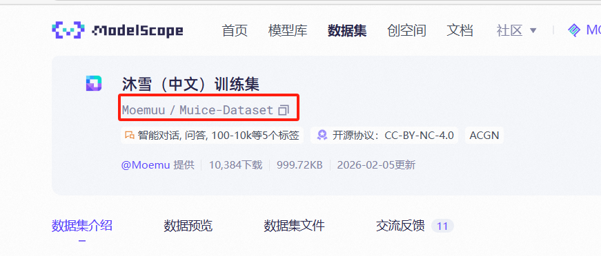
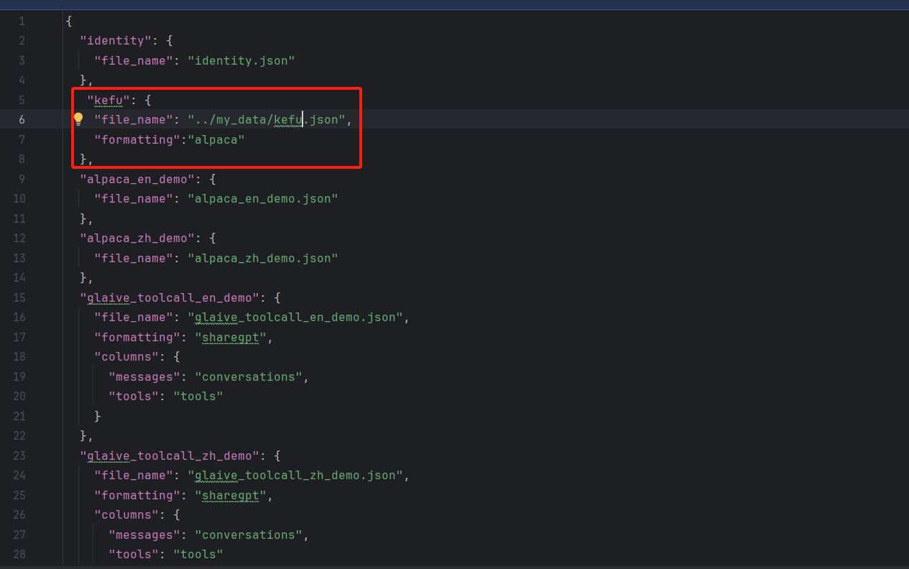

# LLaMA-Factor
如何使用LLaMA-Factory库创建一个微调demo

## 一.下载LLaMA-Factory库
创建conda虚拟环境 ：
```bash
conda create -n LLaMA
```
执行install.sh文件下载LLaMA-Factory库
```bash
sh install.sh
```
下载完成后的文件夹目录如下：
```bash
--你的上级文件
    --finetune
    --LLaMA-Factory
        --examples
            --train_lora
            ...
        --data
            dataset_info.json
            ...
        ...
    --install.sh
```
其中直接修改examples/train_lora/xxx.yaml的配置即可实现对训练过程的配置
（建议在LLaMA-Factory文件夹下面创建一个文件夹my_yaml用来存放自己的配置文件）

## 二.微调数据集准备过程

### 第一步：准备数据集
可先在LLaMA-Factory文件夹下创建文件夹my_data用来存放自己的微调数据集
假设创建数据集为```my_data/kefu.json```
这边kefu.json内容的格式常见的有两种，分别为``` alpaca,sharegpt```

alpaca格式为：
```
[
  #数据1
  {
  "instruction": "你是一个智能客服助手",
  "input": "如何修改账户密码？",
  "output": "您好，修改密码的步骤如下：\n1. 登录账户\n2. 进入设置页面\n3. 点击修改密码\n4. 按照提示完成修改"
  }
  #数据2
  {
  }
  ...
]
```
sharegpt格式为：
```
{
  #数据1
  "conversations": [
    {
      "from": "human",
      "value": "如何修改账户密码？"
    },
    {
      "from": "gpt",
      "value": "您好，修改密码的步骤如下：\n1. 登录账户\n2. 进入设置页面\n3. 点击修改密码\n4. 按照提示完成修改"
    },
    {
      "from": "human",
      "value": "好的，我试一下。如果忘记密码了怎么办？"
    },
    {
      "from": "gpt",
      "value": "如果忘记密码，请点击登录页面的“忘记密码”链接，通过手机或邮箱验证后重置密码。"
    }
  ]
  #数据2
   "conversations": [
                        {
                        "from": "human",
                        "value":"xxxxx"
                        }
`                        ....
                    ]
}
```
因此获取数据集的方式如下：

1.自己生成/使用ai帮忙生成/在晚上下载数据集.json格式 --> 对获取的数据集进行处理，包括将文本切块等 --> 在把获得的数据集转化成上述的alpaca或者是sharegpt等格式。

2.可以直访问modelscope网站 ``` https://www.modelscope.cn/datasets ``` 在上面找到想要的数据集，一般这种数据集都转化好格式可直接使用了。

下载modelscope数据集
```
pip install modelscope -i https://mirrors.aliyun.com/pypi/simple/
modelscope download --dataset Moemuu/Muice-Dataset --local_dir my_data
```
其中--dataset后的参数为下载的名字，比如只需把下图红框复制下来即可


### 第二步：注册数据集

在第一步存在完成后在 ``` LLaMA-Factory/my_data/ ``` 文件夹下已经有了数据集，假设数据集为kefu.json。

进入文件夹 ``` vim data/dataset_info.json ```

dataset_info.json文件内容如图


此时加入的"kefu"即为我们的数据集 ``` "file_name" ``` 参数设置为kefu.json的文件路径。``` "formatting" ``` 设置为格式，图中由于```kefu,json```是alpaca格式的，因此设置为 ``` "formatting":"alpaca" ``` 

## 三.微调模型选取过程

### 第一步：选择合适的微调

常见的微调有：全量微调，冻结微调，lora微调等

在这里使用lora微调，模型为Qwen3-0.6B-base

打开文件夹 ``` LLaMA-Factory/examples/train_lora/llama3_lora_sft.yaml ``` 。后续参数在此基础下调整

在这里推荐把 ``` llama3_lora_sft.yaml ``` 复制一遍放到自己的 ``` my_yawm ``` 文件夹下面，后续可在自己文件夹下修改参数配置。

此时在文件夹 ``` my_data/train.yawl ``` 下的内容为：


